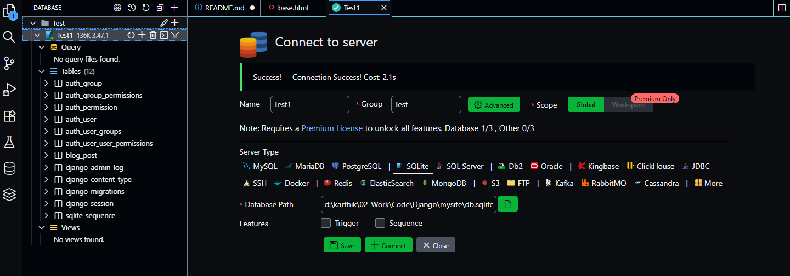
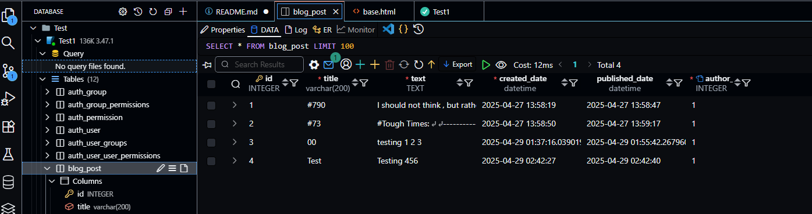

** ARCHITECTURE ** 

** WORKFLOW ** 

** DATABASE details are accessed with the help of extension to read database files **

** DATABASE Detaiks can also be seen within and that can be editted too **

